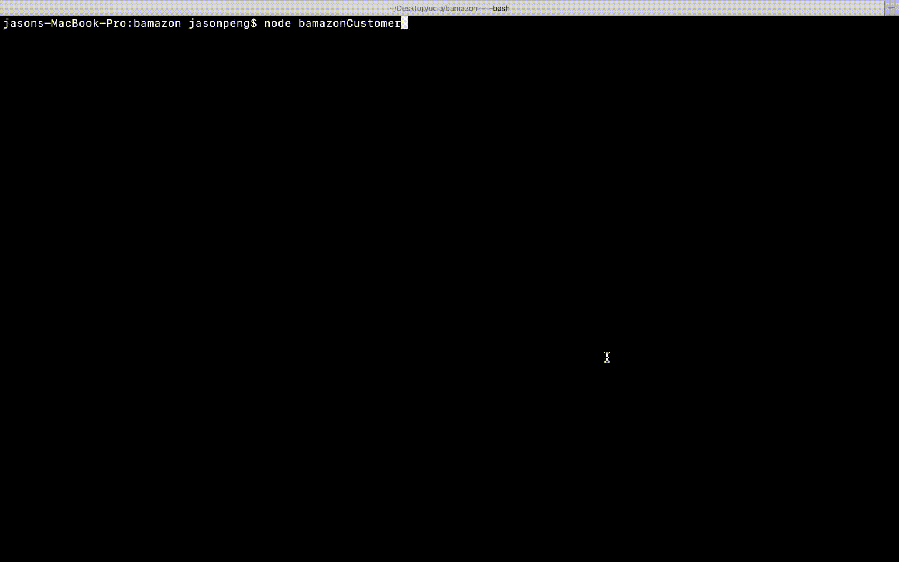
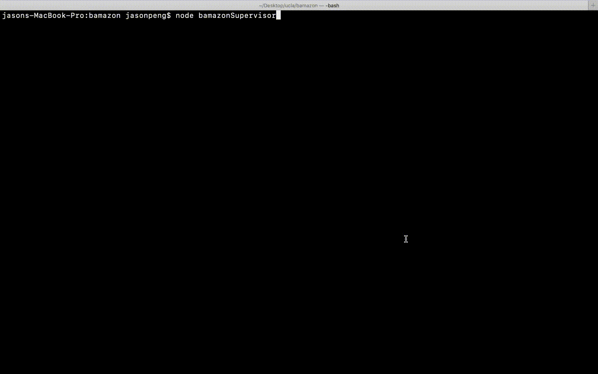
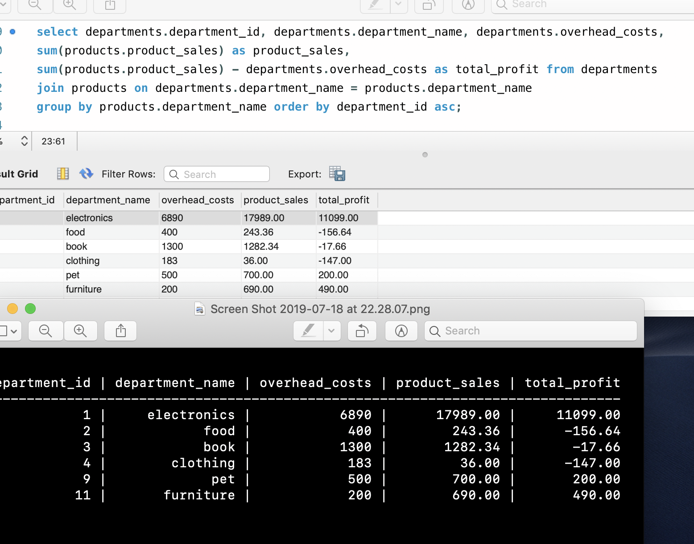

# **bamazon**
## Amazon like store front server side CLI program to manage sales, inventory and profit/loss

##### (The purpose of this program is to create server-side functions for an Amazon-like e-commerce website, only much smaller in the size and less complex. )

There are three modules in this program:
1. bamazonCustomer: for customers to purchase products. 
2. bamazonManager: for manager to manage the inventory and create new products for sale. 
3. bamazonSupervisor: for supervisor to review profit/loss for each departmrnt.

All these three modules are communicate to the centered database server(MySql) to ensure the data integrity. 

---
The following video shows how customer module functions:
* Customers can see a list of products and then enter the item_id and quantity to place orders.
* The program will check the inventory and notiify customers if there are insufficient supplies.
* If there are enough supplies, the program will calculate the total price and update the inventory and record the sales in the centered database. 

---

The following video shows how manager module functions:
* The manager can view all products for sales including inventory and total sales which are unavailable for customers.
* The manager can also see all products in low inventory (less than 5 in this case.)
* The manager can add inventory or change prices for the products.
* The manager can also create new products within a list of departments. The new products will be available to cusomers in real time.

---

The following video shows how supervisor module functions:
* The supervisor can the profit/loss for each department. This data are generated in real time by processing the sales data in the centered Database.
* The supervisor can add overhead costs for each department.
* The supervisor can create a new department, which will be available in managers' department pick list when they create new products, which will also be available for customers to purchase.
* When customers place orders, managers will see the inventory changes and the supervisor would see profit changes in the respective department. 

---

## Coding Challenges
````
This program has many interactive prompts and SQL function call. Carefully arranging the recursive calls and async functions of SQL calls are the key to keep the code clean and readable.
````

>> AS-Table Node module is used to format the search results

The follwoing SQL is used to generate department based profit/loss table:
````SELECT departments.department_id, departments.department_name, departments.overhead_costs, 
SUM(products.product_sales) AS product_sales, 
SUM(products.product_sales) - departments.overhead_costs AS total_profit FROM departments 
JOIN products on departments.department_name = products.department_name
GROUP BY products.department_name ORDER BY department_id ASC;
````
The following shows the SQL, Database Table and Results from teh program.

